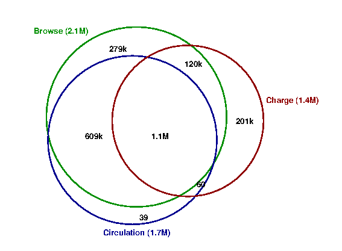
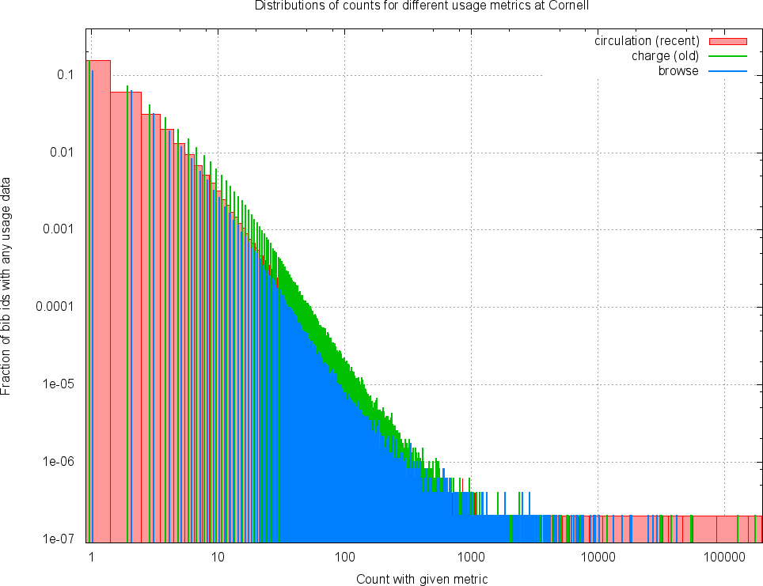
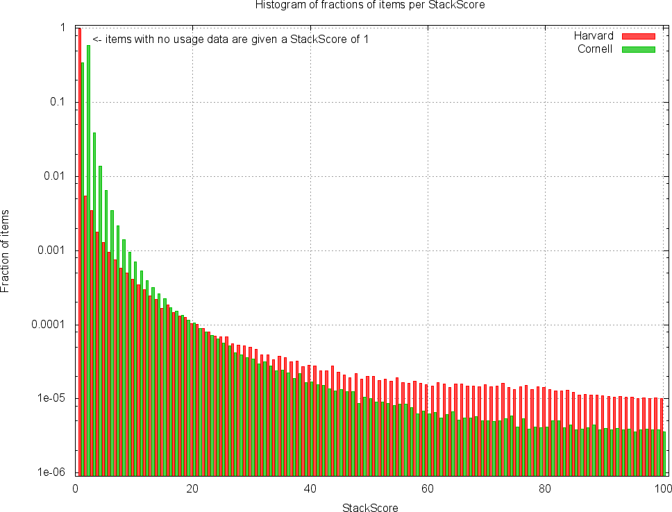

# Analysis of Cornell usage data

## Analysis run to look at different metrics

Run on full usage data:

```
simeon@RottenApple ld4l-cul-usage>time ./parse_cul_usage_data.py -v --analyze --charge-and-browse=/cul/data/voyager/charge-and-browse-counts.txt.gz --circ-trans=/cul/data/voyager/circ_trans.txt.gz 
INFO:root:STARTED at 2015-06-25 14:09:20.157691
INFO:root:Reading charge and browse counts from /cul/data/voyager/charge-and-browse-counts.txt.gz
...warnings snipped...
INFO:root:Reading circulation transactions from /cul/data/voyager/circ_trans.txt.gz
INFO:root:Writing charge_dist.dat...
INFO:root:Writing browse_dist.dat...
INFO:root:Writing circ_dist.dat...
INFO:root:Writing usage_venn.dat...
INFO:root:FINISHED at 2015-06-25 14:13:42.725385

real		   4m22.759s
user		   4m20.916s
sys		   0m1.376s
```

Then the files `charge_dist.dat`, `browse_dist.dat`, and `circ_dist.dat` have the distributions of counts for historical charges, browses, and circulation transactions. The file `usage_venn.dat` has Venn diagram data for overlap of the metrics which is represented graphically in:



The gnuplot file `metric_distributions.gnu` plots the distributions of data from the three metrics on the same plot. The results demonstrate very similar forms for the metrics, and even very similar scales. PDF in `metric_distributions.pdf`: 



## Computing a StackScore and comparing with Harvard data

Run code without `--analyze` option to compute raw score and normalized StackScore:

```
simeon@RottenApple ld4l-cul-usage>time ./parse_cul_usage_data.py -v --charge-and-browse=/cul/data/voyager/charge-and-browse-counts.txt.gz --circ-trans=/cul/data/voyager/circ_trans.txt.gz 
INFO:root:STARTED at 2015-06-25 15:35:38.839019
INFO:root:Reading charge and browse counts from /cul/data/voyager/charge-and-browse-counts.txt.gz
...warnings snipped...
INFO:root:Reading circulation transactions from /cul/data/voyager/circ_trans.txt.gz
INFO:root:Writing raw_scores_dist.dat...
INFO:root:Writing stackscore_dist.dat...
INFO:root:FINISHED at 2015-06-25 15:39:36.657549

real	3m57.982s
user	3m56.761s
sys	0m0.983s
```

The code doesn't actually write out the `bib_id`->StackScore mappings at present, but writes information about the distributions. It also doesn't have access to all Cornell bibliographic records so it assumed a total of 7M records where any not included in the usage data have no usage data.

The StackScore is an interger from 1 to 100 where 1 is intended to indicates lowest community use, and 100 highest community use. The distribution of StackScore values in Harvard data (as used for [StackLife](http://stacklife.harvard.edu/) where higher scores are represented with a darker blue for the book spine and metadata summary block) is in `harvard_stackscore_distribution.dat`. Details of the sources of data used and the generation of these scores are given in [Paul Deschner's slides](https://wiki.duraspace.org/download/attachments/68060801/LD4L%20Usage%20Data.pdf?version=1&modificationDate=1425566384182&api=v2) from the [LD4L workshop](https://wiki.duraspace.org/display/ld4l/LD4L+Workshop+Agenda). Some features of the data are:

  1. There are ~13.5M items
  2. 98% of these items are assigned the lowest score of 1, this is equivalent to saying that only 2% get any usage-derived highlighting (Harvard have some usage information 11.5% of all items but many of these are aggregated into the score 1 bin).
  3. Scores have been normalized so that about 140 items (0.001% of all items) are in each of the top scores (100, 99, 98...), rising slowly to 277 items (0.002% of all items) with score 50, and about 1000 items with score 25.
  
I have calculated a score for Cornell data using a similar normalization approach. Distribution is in `cornell_stackscore_distribution.dat` and below is a comparion of the Cornell and Harvard distributions (also PDF in `compare_stackscore_distributions.pdf`):



Features from the comparison:

  1. 
