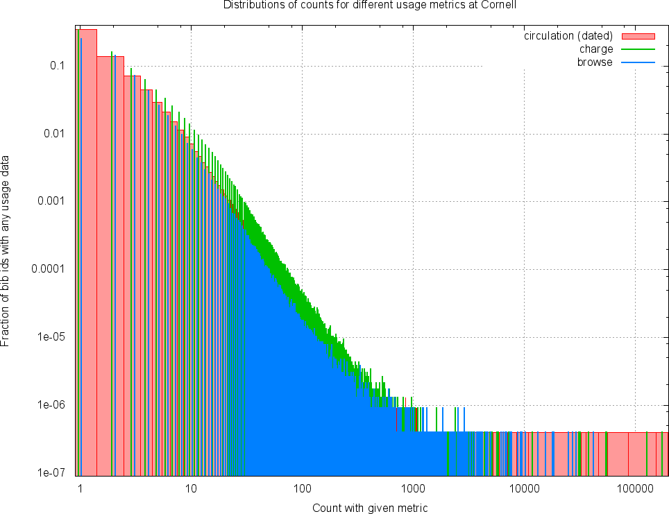

# Analysis of Cornell usage data

## Analysis run to look at different metrics

Run on full usage data:

```
simeon@RottenApple ld4l-cul-usage>time ./parse_cul_usage_data.py -v --analyze --charge-and-browse=/cul/data/voyager/charge-and-browse-counts.txt.gz --circ-trans=/cul/data/voyager/circ_trans.txt.gz 
INFO:root:STARTED at 2015-06-25 14:09:20.157691
INFO:root:Reading charge and browse counts from /cul/data/voyager/charge-and-browse-counts.txt.gz
...warnings snipped...
INFO:root:Reading circulation transactions from /cul/data/voyager/circ_trans.txt.gz
INFO:root:Writing charge_dist.dat...
INFO:root:Writing browse_dist.dat...
INFO:root:Writing circ_dist.dat...
INFO:root:Writing usage_venn.dat...
INFO:root:FINISHED at 2015-06-25 14:13:42.725385

real		   4m22.759s
user		   4m20.916s
sys		   0m1.376s
```

Then the files `charge_dist.dat`, `browse_dist.dat`, and `circ_dist.dat` have the distributions of counts for historical charges, browses, and circulation transactions. The file `usage_venn.dat` has Venn diagram data for overlap of the three metrics which is represented graphically in:


There is data for a total of 2345788 `bib_ids`. The very small numbers of `bib_ids` represented in the circulation transactions which have no matching entry in the charge counts are likely records for items that have been deleted. Otherwise, this overlap provides confirmation that all circulation transactions have been reflected in the charge counts.

The gnuplot file `metric_distributions.gnu` plots the distributions of data from the three metrics on the same plot. The results demonstrate very similar forms for the metrics, and even very similar scales. PDF in `metric_distributions.pdf`: 



## Computing a StackScore and comparing with Harvard data

Run code (done 2015-06-25, commit eed4518638b496d0c5f11d48f0e7c1a41c901c5b) without the `--analyze` option to compute raw score and normalized StackScore:

```
simeon@RottenApple ld4l-cul-usage>time ./parse_cul_usage_data.py -v --charge-and-browse=/cul/data/voyager/charge-and-browse-counts.txt.gz --circ-trans=/cul/data/voyager/circ_trans.txt.gz 
INFO:root:STARTED at 2015-06-25 15:35:38.839019
INFO:root:Reading charge and browse counts from /cul/data/voyager/charge-and-browse-counts.txt.gz
...warnings snipped...
INFO:root:Reading circulation transactions from /cul/data/voyager/circ_trans.txt.gz
INFO:root:Writing raw_scores_dist.dat...
INFO:root:Writing stackscore_dist.dat...
INFO:root:FINISHED at 2015-06-25 15:39:36.657549

real	3m57.982s
user	3m56.761s
sys	0m0.983s
```

The code doesn't actually write out the `bib_id`->StackScore mappings at present, but writes information about the distributions. It also doesn't have access to all Cornell bibliographic records so it assumed a total of 7M records where any not included in the usage data have no usage data.

The StackScore is an interger from 1 to 100 where 1 is intended to indicates lowest community use, and 100 highest community use. The distribution of StackScore values in Harvard data (as used for [StackLife](http://stacklife.harvard.edu/) where higher scores are represented with a darker blue for the book spine and metadata summary block) is in `harvard_stackscore_distribution.dat`. Details of the sources of data used and the generation of these scores are given in [Paul Deschner's slides](https://wiki.duraspace.org/download/attachments/68060801/LD4L%20Usage%20Data.pdf?version=1&modificationDate=1425566384182&api=v2) from the [LD4L workshop](https://wiki.duraspace.org/display/ld4l/LD4L+Workshop+Agenda). Some features of the data are:

  1. There are ~13.5M items
  2. 98% of these items are assigned the lowest score of 1, this is equivalent to saying that only 2% get any usage-derived highlighting (Harvard have some usage information 11.5% of all items but many of these are aggregated into the score 1 bin).
  3. Scores have been normalized so that about 140 items (0.001% of all items) are in each of the top scores (100, 99, 98...), rising slowly to 277 items (0.002% of all items) with score 50, and about 1000 items with score 25.
  
I calculated an initial score for Cornell data using a similar normalization approach to the Harvard data: putting an equal number of bins in each score 2-100, with the rest in score 1. The raw scoring algorithm was very simple: browses*1 + charges*3 + circulations*5 (which has a double counting of ciculations because they are also present as a charge count). Distribution is in `cornell_stackscore_distribution_2015-0625.dat` and below is a comparion of the Cornell and Harvard distributions (also [PDF](compare_stackscore_distributions_2015-06-25.pdf)):


Features from the comparison between Cornell and Harvard data:

  1. The Cornell data has a _thinner_ tail at high stackscore than the Harvard data. This is because the method of grouping is sensitive to the number of different raw scores -- with fewer raw scores there are fewer single-item high scores to group into high stack-score for the Cornell data.
  2. The Cornell data has a smaller fraction of items with no usage information, and hence stackcore 1, than the Harvard data. In a system such as [StackLife](http://stacklife.law.harvard.edu/) there is essentially no difference shown in the UI between stackscore 1 and stackscore 2. However, if we had a system where search result ordering was adjusted based on stackscore, then a search with no high-scoring results could have result order significantly affected by the differences in low stackscores (as almost 93% of Cornell items have stackscore 1 or 2 in the above).

Without other information to indicate how the distributions should differ between institutions, it seems likely (unproven!) that the most sharable and mixable data would result from each instition's StackScores having a similar disrtibution. I thus adjusted the code to take a cumulative disctribution (counting from stackscore 100 down to 1) as the 'gold standard' and binning new data according to that. I've then used the Harvard distribution as the input to match.

Also, in order to do something that uses the circulation date to provide a smooth score increase for more recent use I have applied an exponential decay to circulation data scoring so the overall algorithm is now:

```
    score = charges * charge_weight +
            browses * browse_weight +
            sum_over_all_circ_trans( circ_weight + 0.5 ^ (circ_trans_age / circ_halflife) )
```

This means that a circulation that happens today will score (charge_weight+circ_weight) whereas on the happened circ_halflife ago will score (charge_weight+0.5*circ_weight). An old circulation event that is recored only in the charge counts will score just charge_weight. I have no principled way to adjust the weights and halflife, for now they are:

```
    charge_weight = 2 
    browse_weight = 1
    circ_weight = 2
    circ_halflife =  5 years
```


## Possible additional sources of data not currently used

  * Course reserves
  * Number of holdings for a given item
  * Number of locations with a holding of a given item
  
